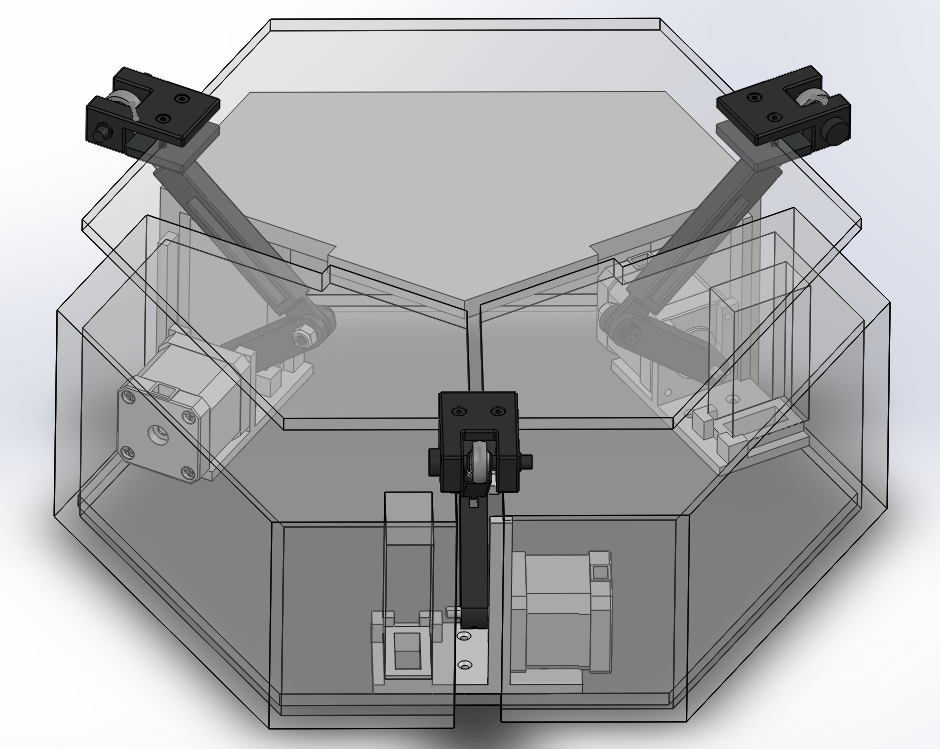

# Stewart Platform - Ball Balancing Control System



This project controls a Stewart platform to balance a ping pong ball using a Raspberry Pi (RPi), an STM32 microcontroller, and stepper motor drivers. The system uses a PID control loop to adjust the platform's pitch and roll based on the detected position of the ball, while employing computer vision to track the ball's location.

## Overview

The system leverages OpenCV for real-time image processing to detect the position of a yellow or squash ball using a webcam. The detected position is then used to compute the necessary adjustments for the Stewart platform's motors to keep the ball balanced. Communication between the Raspberry Pi and STM32 microcontroller is facilitated through I2C.

### Key Components

- **Raspberry Pi (RPi)**: Runs Python code for video capture, PID control, and I2C communication.
- **STM32**: Controls the stepper motors on the Stewart platform based on commands received via I2C.
- **Webcam**: Captures video feed to detect the ball's position.
- **Stepper Motors**: Control the tilt (pitch and roll) of the Stewart platform.
- **I2C Communication**: Sends control signals from the Raspberry Pi to the STM32.

## Requirements

- Raspberry Pi with I2C enabled
- STM32 microcontroller
- Webcam
- OpenCV and NumPy installed on Raspberry Pi
- Stepper motor driver for controlling motors

## Installation

### 1. Install dependencies on Raspberry Pi
Ensure the following Python packages are installed:
```bash
pip install opencv-python numpy smbus
```

### 2. Enable I2C on Raspberry Pi
Enable I2C communication on your Raspberry Pi:
```bash
sudo raspi-config
```
Navigate to Interfacing Options > I2C > Enable.


### 3. Hardware Setup
Connect the Raspberry Pi to the STM32 via I2C.
Connect stepper motors to the STM32 according to your platform’s specifications.

### 4. Adjust Constants
In the main.py file, adjust the following constants as needed:

`microstep`: Microstepping value for stepper motors.

`motor_speed`: Speed of the motors, multiplied by microstep.

`PID coefficients`: `Kp`, `Ki`, `Kd` for PID control.

`max_step`, `min_step`, `offset`, `neutral`: Stepper motor movement limits.


### 5. Running the Script
Run the script on the Raspberry Pi:

```bash
python main.py
```
The system will start capturing video, detect the ball, and control the Stewart platform to balance it.

### 6. Exit the Program
Press 'q' to exit the program and stop the motor control.

## How it Works
Video Capture and Ball Detection
The webcam captures video, and the program uses OpenCV to detect a yellow or squash ball in the video frame. The ball's position `(x, y)` is tracked and used to calculate necessary adjustments for the Stewart platform.

## PID Control
The program uses a PID controller to calculate the required adjustments for the Stewart platform to balance the ball. The error (difference between desired and detected position) is processed by the PID controller, and commands are sent to the STM32 to adjust the platform.

## I2C Communication
The Raspberry Pi communicates with the STM32 via I2C. The STM32 adjusts the stepper motors to tilt the platform.

## Trajectory Control (Optional)
If `do_trajectory` is set to `True`, the system will follow predefined trajectories, like a line or triangle, to guide the platform in specific movements.

## Line Detection
The system also supports line detection using Hough Line Transform to detect the relative position of the platform.

## Customization
Modify line_trajectory or triangle_trajectory variables for different platform movement patterns.
Adjust PID constants (`Kp`, `Ki`, `Kd`) to fine-tune the system’s responsiveness.
The code can be expanded to handle different colored balls (e.g., squash balls) by modifying HSV color thresholds.

## STM32 Firmware (console.cpp)
The `console.cpp` file handles user input over UART and sends commands to control the stepper motors. Commands include:

`debug [value]`: Toggles debug messages.

`stop [motor_number]`: Stops the specified motor (1, 2, or 3).

`test`: Verifies system functionality.

`reset`: Resets all motors' stepper positions.

`move [height]`: Moves the platform to a specified height.

`on`: Enables all motors.

`off`: Disables all motors.

`n`: Automatically moves motors through predefined heights.


## License
This project has no official license. Feel free to modify and use it for educational and personal purposes.